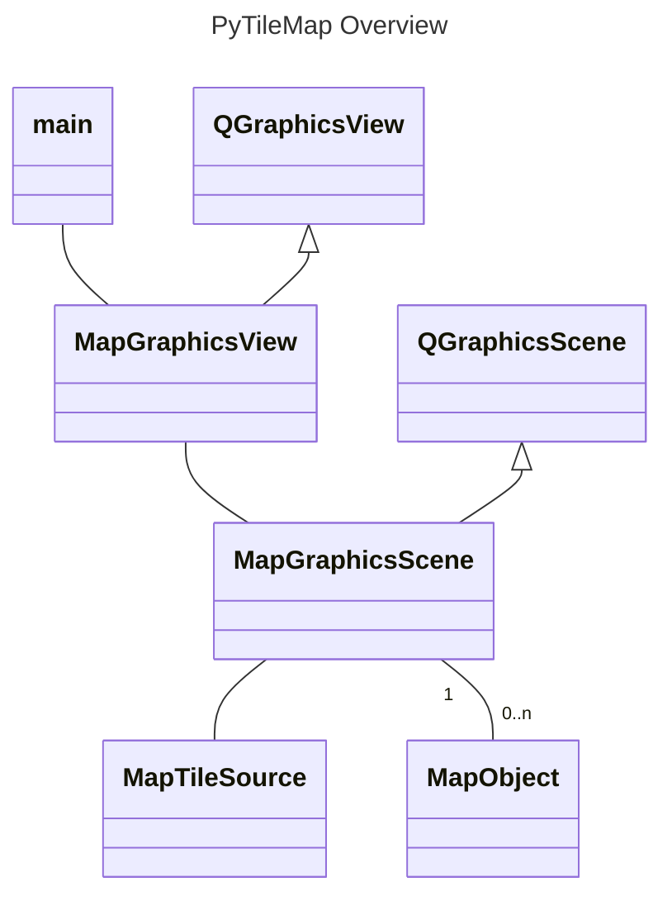

# Class Overview



# Tile Seqeuence

```mermaid

---
title: Tile Sequence
---
sequenceDiagram
    MapGraphicsScene ->> MapObject sigZoomChanged
    MapTileSource ->> MapGraphicsScene tileReceived
    MapGraphicsScene ->> MapTileSource requestTile

``` 

# Map Objects

```mermaid

---
title: Object Sequence
---
sequenceDiagram
    main ->> MapGraphicsScene addRectShape
    MapGraphicsScene ->> MapGraphicsScene addItem
    MapGraphicsScene ->> QGraphicsScene addItem
    MapGraphicsScene ->> main item

``` 


